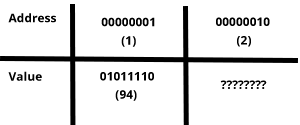
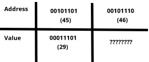

# Lesson Five: Arrays

In this section we’ll go under the hood and talk about how array generally work in most programming languages and the tradeoffs and limitations of arrays.

##### Read
 I know what you're thinking:
> I already know what arrays are, why am I even on this page?

There might be a few properties of arrays you're not familiar with. Let us fill you in.
##### What you should already know

-   An array is a collection of items. Basically think like a list (or bunch) of items.
-   An array has a certain order to it. That means once you can expect things to consistently come out in the same order.
-   Given an array, you can easily exact a value in a certain position.

##### What you probably don't know!

To deeply understand how arrays work you need to actually understand how memory allocating works, because arrays have some quirks due to how they allocate memory.

The concept of an array exists in most programming languages, and they generally work pretty similarly. In general arrays will have their memory allocated next to each other.

##### Reference vs. Values

In the previous lessons we walked you through how numbers are represented on the byte level. Let's take the number 94. In our computer it could be represented by the digits 01011110. So somewhere in our computer memory those digits exist to represent the value of 94. It turns out memory has what is known as an address, which is the place in memory it lives. These are represented by very large numbers.

So on the machine it could look like this, if the value happened to be allocated to the first memory address.

So there are two details that actually matter, which happen behind the scenes. There is the value of 94, which are the actual digits. Sometimes things will store the address of memory where the true value resides so it can looked up later. Looking something up by address is called by reference.

If you're familiar with the programming languages C or C++, you need to control memory yourself, meaning you need to allocate, deallocate and deal with the difference between a reference and a value ALL the time. In ruby-land you don't need to worry about it so much.

So let's store another number in memory. Let's have this one be the value 29. Let's say this happens to get memory address 45

So now let's say we want to build an Array of these integers. So represent [94, 29]. What ruby will do is it will allocate two blocks of space that are next to each other and put the address in the location.

##### A Diagram of How the Array Is Represented In Memory

So Arrays are a data type that is built by allocating n contiguous bytes, where n is the size of the array (they'll often also include meta data, like how long is the array, this is an oversimplification). A slot of memory includes a link to the actual value in memory.

##### Now to the gotcha! Deep vs. Shallow Copies

Given an array, which is represented like this, if you wanted to copy the array you could do it two ways.

-   Shallow copy - copy the values in the array itself to a new 2-byte memory location, in this case 1,45.
-   Deep copy - follow the reference and find the true value inside the array. Then copy those values (in this case 94, 29) into two new memory locations. Then build a new array which points to the copies of the item we initially built.

 ## Watch
 Watch the following video provided by HackerRank.  
 

 ## Solve

> If you like knowing what happens under the hood
> 
> The programming language C is a fairly simple programming language, but requires you know how things work deep in the computer. Most programmers with more than a couple years of experience have at least dabbled in C at one point in their life.
> 
> If you want to get your hands dirty with C programming checkout The Beginner's Guide to GCC.
> 
> If you do so, try to learn enough to solve these two challenges in C:
> 
> - FizzBuzz
> - Reverse a String (or rather an array of chars)