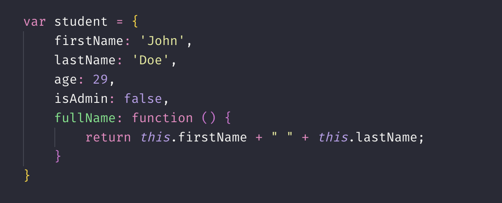

# Lesson Six: Hash Tables

In this section we’ll discuss how hash tables (basically another way of saying object in JavaScript) work under the hood and introduce the concept of a hash table collision.

## Read

Just like with arrays, you may think you're already a master of hash tables. While you know about how they work in practice, this lesson will go a bit deeper.

##### What you should already know

-   A hash table or object is a collection of key value pairs.
-   In NodeJS the syntax for this looks like
    
    `myObject = { key: value }`
    
    or
  
    `myObject = {"key": value}`
    
    
-   You can easily extract the right-hand side of the table if you have the key from the left side. So for example
    
    `myObject.key`
    
    or
    
    `myObject['key']`
    
    would extract the string 'value' from the above hash.
-   Hash table lookups are generally fast.

##### Everything is an object!

In JavaScript, almost "everything" is an object.

-   Booleans, numbers and strings can be objects (if defined with the new keyword)
-   Dates are objects
-   Arrays are objects
-   Objects are objects... duh!
-   JavaScript values, other than primitive values, are objects

Basically every language has their own version of objects, and JavaScript objects are similar to:

-   Associative arrays in PHP
-   Dictionaries in Python
-   Hash tables in C
-   Hash maps in Java
-   Hashes in Ruby and Perl

##### Object Methods

Methods are actions that can be performed. When we aren't using them inside of an object, we usually refer to these as functions in JavaScript. Methods are simply functions nested inside of an object.

In this object, fullName is an object method that returns the firstName and lastName of the object that it is currently in.

## Watch

Watch the following video provided by HackerRank.

## Solve

 
> No challenge yet...
